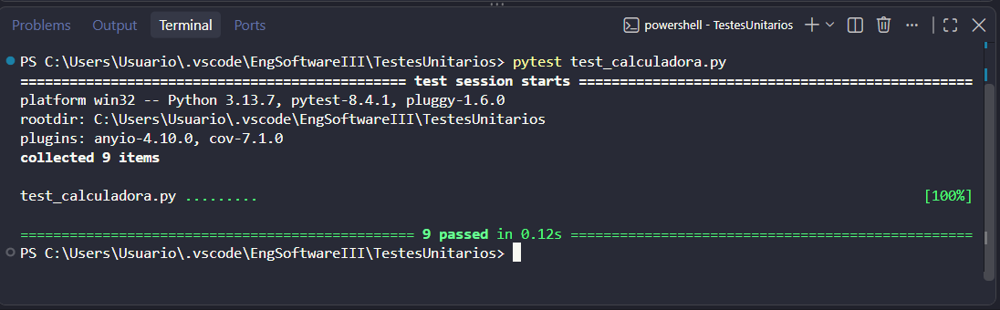
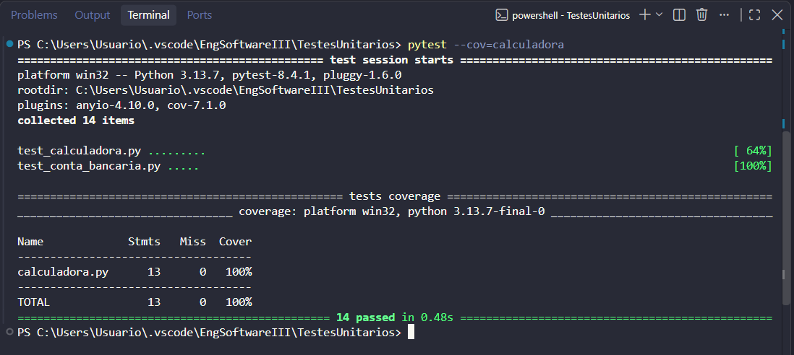

## **Testes Unitários**
### **Calculadora**
#### Objetivo:
Realizar as quatro operações: soma, subtração, multiplicação e divisão.
#### Exceção:
Se um dos valores da divisão for zero, deve lançar um erro.
___
### **Imagens dos Testes**
#### `pytest test_calculadora.py`

#### `pytest --cov=calculadora`

